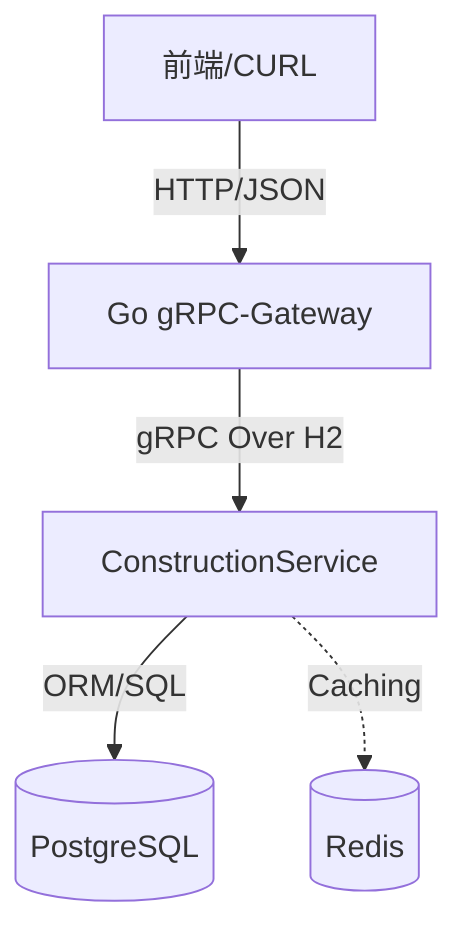
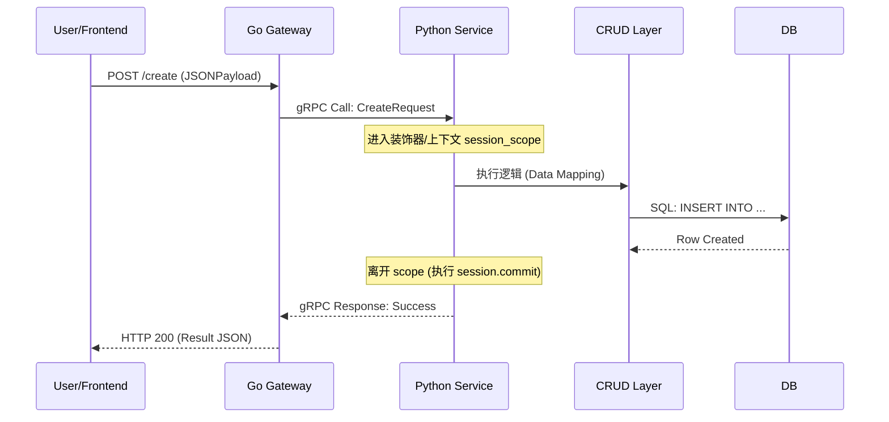

# 施工进度计划模块 详细设计文档

> [!NOTE]
> **🤖 AI 生成声明**
> 本文档内容由 AI 自动生成并整理。在阅读和使用过程中，请结合实际项目情况进行人工复核。

> **文档版本**: v1.0.0
> **状态**: 已归档
> **作者**: zhangsan
> **日期**: 2026-01-29

## 1. 业务概述
**说明**: 本章节旨在明确功能的具体业务背景、目标用户以及核心业务流程，使读者快速理解模块存在的意义。

### 1.1 背景与目的
本项目旨在为 AI Agent 提供施工现场的进度管理能力。该模块负责施工计划的创建、列表查询及物理删除，是后续 AI 自动提取施工进度数据的基础。

### 1.2 核心流程
1.  **管理后台/前端** 调用 Go 网关提供的 REST 接口。
2.  **Go 网关** 转发请求至 Python 后端服务。
3.  **Python 服务** 负责业务逻辑校验及数据库/持久化操作。

---

## 2. 总体架构设计
**说明**: 使用图表形式展示系统组件间的物理与逻辑连接。本项目强调多语言协同，重点描述 Go 网关、Python 服务、数据库以及中间件（如 Redis）之间的调用拓扑。

### 2.1 架构拓扑图

### 2.2 技术选型说明
- **Go gRPC-Gateway**: 负责反向代理及协议转换（HTTP -> gRPC）。
- **Python gRPC Server**: 业务逻辑承载中心，擅长 AI 生态集成。
- **PostgreSQL**: 核心业务数据存储，具备强一致性保障。

---

## 3. 接口设计 (IDL)
**说明**: 详细规定接口的契约，包含 Protobuf 的定义以及通过注解生成的 RESTful 映射关系，确保前后端理解一致。

### 3.1 gRPC 契约与 REST 映射
本项目接口定义于 `proto/agent/v1/constructionprogress/construction.proto`。

| RPC 方法 | HTTP 映射 | 功能描述 | 请求参数关键项 |
| :--- | :--- | :--- | :--- |
| `ListConstruction` | **POST** `/api/v1/construction/progress` | 分页列表查询 | `page`, `page_size` |
| `CreateConstructionProgress` | **POST** `/api/v1/construction/create` | 新增施工计划 | `name`, `plan_type`, `creator` |
| `DeleteConstructionProgress` | **DELETE** `/api/v1/construction/{id}` | 物理删除记录 | `id` (路径参数) |

---

## 4. 数据库设计
**说明**: 提供底层存储的具体物理结构定义。对于本项目，需重点描述 SQLAlchemy 模型的字段映射、类型选择及约束条件。

### 4.1 模型结构 (`ConstructionProgress`)
表名：`construction_progress`

| 字段名 | 类型 | 约束 | 说明 |
| :--- | :--- | :--- | :--- |
| **id** | Integer | PK, AutoInc | 系统生成的唯一主键 |
| **name** | String(200) | Not Null | 施工计划的标题 |
| **type** | String | Default('1') | 计划类型（如进度/质量/安全） |
| **progress** | String | - | 当前状态枚举值 |
| **creator** | String | Index | 该记录的创建人 |
| **created_at** | DateTime | Default(Now) | 记录创建时间 |
| **updated_at** | DateTime | OnUpdate(Now) | 记录最后更新时间 |

---

## 5. 核心逻辑实现
**说明**: 通过序列图展示复杂的跨层交互。本项目重点演示事务流转，即请求如何穿透网关进入 Python 后端，并利用 `session_scope` 机制完成自动事务提交。

### 5.1 事务传递序列图 (以创建操作为例)

### 5.2 边界校验处理
- **参数限制**: 强制校验 `plan_type` 是否在合法枚举范围内。
- **空请求**: 接口层拦截长度为 0 的 `name` 字段。
- **并发控制**: 目前使用数据库行级锁保证同一记录不会被重复创建或冲突修改。

---

## 6. 异常处理与可靠性
**说明**: 规定系统在面临不确定性时的应对策略。涵盖业务错误码规范化、幂等性设计以及崩溃后的 Failover 处理。

### 6.1 错误码表现
- **400 Bad Request**: 参数校验失败。
- **404 Not Found**: 删除或查询不存在的 ID。
- **500 Internal Error**: 数据库连接断开或代码逻辑崩溃。

### 6.2 故障恢复与故障转移 (Failover)
- **服务自愈**: 生产环境通过 K8s `RestartPolicy` 监控，确保进程挂掉后秒级重启。
- **事务原子性**: 依靠 `session_scope` 确保 Crash 时数据库自动 Rollback，保证不产生“半截”数据。
- **幂等设计**: `Delete` 操作支持多次调用不报错（即删除一个已不存在的 ID 仍返回成功）。

---

## 7. 部署与伸缩性
**说明**: 描述项目运行环境的配置以及针对压力进行水平扩展。

### 7.1 Docker 配置
项目依赖根目录下的 `Dockerfile` 构建，内部包含多阶段镜像减小体积。

### 7.2 监控指标 (Metrics)
建议在监控系统中观测：
- **gRPC Latency**: 每个接口的响应耗时。
- **DB Connection Pool**: 数据库连接池使用率，防止死锁。
- **Memory RSS**: Python 服务的内存占用，尤其是加载大模型时。

---

## 8. 修订记录
| 日期 | 修订内容 | 作者 |
| :--- | :--- | :--- |
| 2026-01-29 | 1.0 初始版本 | zhangsan |
| 2026-01-29 | 1.1 完善各章节设计说明与模板定义 | zhangsan |
