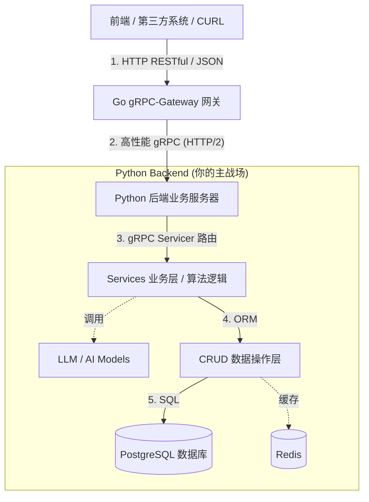

# Agent-BE: 面向算法工程师的统一开发框架介绍

> [!NOTE]
> **🤖 AI 生成声明**
> 本文档内容由 AI 自动生成并整理。在阅读和使用过程中，请结合实际项目情况进行人工复核。

Gemini3.1: 各位算法团队的同学，大家好！我是 Agent-BE 项目的 Owner。很高兴大家加入或者使用 Agent-BE 作为你们开发底层 AI Agent 能力的基础设施。

作为算法工程师，大家的强项在于模型训练、提示词工程（Prompt Engineering）、LLM 的微调以及各种 AI 链路的搭建。但当我们把模型推向生产环境时，往往还要面临高并发处理、网络协议编解码、数据库事务一致性、系统监控等一系列底层后端工程问题。

**Agent-BE 就是为了解决这些工程烦恼而诞生的框架。** 它的核心设计理念是：**让算法工程师能 100% 专注于 Python 生态下的模型与业务逻辑开发，其余的并发、网关映射等脏活累活全权交给框架底座处理。**

---

## 1. 系统架构图 (Architecture)

我们采用了 Go + Python 的**多语言异构微服务架构**。以下是系统的流转架构图：



> [!NOTE]
> **为什么要这么设计？**
> - **Go 网关层**：Go 语言天生的高并发特性非常适合接管所有外网的 HTTP API 请求。它负责限流、鉴权、日志，并将 JSON 转换为高效压缩的 Protobuf。这层对大家是**完全透明**的，你不需要写一行 Go 代码。
> - **Python 服务层**：这是大家最熟悉的语言环境（Python 3.10+）。你写好的 AI 逻辑、数据预处理，都在这里运行。通过 gRPC 纯粹地接收来自网关的内部请求，没有任何 HTTP 解析的业务负担。

---

## 2. 安全性审计说明 (Security Audit)

> [!IMPORTANT]  
> 作为全栈架构师，保障系统安全至关重要。我们在框架层默认了以下安全增强措施，这是大家在写代码时需要铭记的。

1. **协议/网关抗压安全**：入口流量全部由 Go gRPC-Gateway 挡住，非法端点直接抛弃。Python 的 `main.py` 我们已经预置了严密的 `Keepalive` 参数，可以防御 `too_many_pings` 断线流攻击 (ENHANCE_YOUR_CALM 异常)，并确保在长耗时的 AI 推理时连接不断开。
2. **数据 SQL 注入防范**：数据库操作强制走 SQLAlchemy ORM。请**千万注意**在后续扩展里不要手写拼接字符串的 Raw SQL，以防 SQL 注入风险。
3. **事务强一致性安全**：推荐使用上下文管理器（例如 `session_scope`）来管理数据库链接。在你的 AI 判断发生 `Exception` 时，框架会自动 `Rollback` 你的数据库写入，杜绝产生残缺的半截脏数据。

---

## 3. 项目目录结构与各文件夹作用 (Directory Structure)

为了让大家快速上手，这里列出了核心项目结构的说明。开发过程中，你的代码几乎都会落在 `proto/` 和 `src/` 这两大块中。

```text
agent-be/
├── proto/              # [核心] API 定义契约层 (IDL)
│   ├── agent/v1/       # 所有的 .proto 文件存放地，定义了接口、参数和返回格式
│   └── swagger/        # 自动生成的 Swagger API 文档目录。它是根据 .proto 文件编译自动生成的 JSON 文件，直接提供给前端/业务方查看和联调 RESTful 接口使用，**无需也绝对不要手动修改**。
├── src/                # [核心] Python 业务核心代码 (你的主战场)
│   ├── config/         # 存放配置文件和加载逻辑（如数据库账号、Redis地址等）
│   ├── core/           # 框架核心组件：异常拦截器、安全依赖、中间件、数据库 Session 引擎
│   ├── models/         # 数据库表结构定义（SQLAlchemy ORM Models）
│   ├── crud/           # 数据操作层，基于 Models 实现底层的 增删改查 函数
│   ├── schemas/        # Pydantic 校验模型（如果需要内部数据复杂验证）
│   ├── services/       # 业务逻辑层（算法入口）：所有具体的 AI 推理调度、业务链路组装均在此实现
│   └── main.py         # 你的 Python gRPC 服务启动入口
├── doc/                # 存放项目整体和各模块的说明文档、架构设计图
├── scripts/            # 开发维护脚本（如数据库迁移、自动生成代码脚本等）
├── logs/               # 服务运行日志（会被 Docker Volume 挂载出来）
├── main.go             # Go Gateway 网关入口（算法组完全无需修改）
└── Makefile            # 工程命令集中管理，运行 `make start` 等指令的地方
```

---

## 4. 你的主战场在哪里？拓展开发实战指南

当业务提来一个新需求——比如：“我们要加一个智能分析文档的接口”，你应该怎样在 Agent-BE 里开发？只需要三步经典流水线：

### 第一步：契约驱动开发（定义输入输出）
在 `proto/` 目录下创建你的 `.proto` 文件，定义想要接收的参数和返回的格式，并用注解将其映射成前端需要的 RESTful HTTP 端点 (如 `POST /api/v1/analyze`)。

> [!TIP]
> **写完 `.proto` 之后，系统能干什么？**
> 系统不仅能自动帮你生成接口文档供前端联调，还能自动生成 Go 的网关转换逻辑以及 Python 层面的基类代码。这就是“定义一次，四处生效”。

### 第二步：数据库结构与持久化 (Models & CRUD)
如果分析结果要存到数据库中：
1. **Models建表**：在 `src/models/` 目录按照规则添加一个 SQLAlchemy Model 类。
2. **CRUD操作**：在 `src/crud/` 目录下添加最基础的“增、删、改、查”工具函数。

### 第三步：填充你的算法灵魂 (Services)
在 `src/services/` 下新建 Python 文件继承第一步中自动生成的基础类，专心去调用你的大模型吧！

大家可以看出，在这个框架下，你**写出的业务代码干净、健壮，没有任何多余的网络处理代码混杂其中**。欢迎大家随时针对这套体系开展自己的工作，遇到任何框架底层扩展问题，随时找我探讨！
